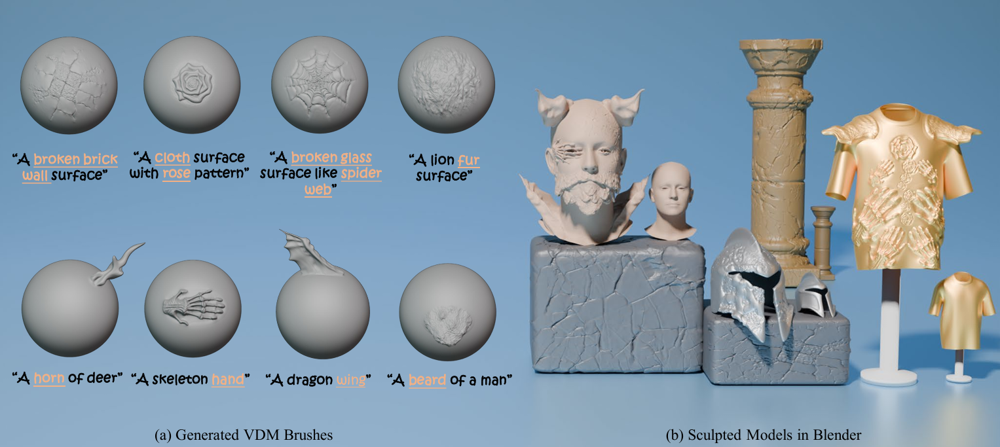

# Text2VDM: Text to Vector Displacement Maps for Expressive and Interactive 3D Sculpting

<h4 align="center">
[Hengyu Meng](https://hengyumeng.github.io/), [Duotun Wang](https://www.duotun-wang.co.uk/), [Zhijing Shao](https://initialneil.github.io/), [Ligang Liu](http://staff.ustc.edu.cn/~lgliu/), [Zeyu Wang]([Zeyu WANG | CIS Lab @HKUST(GZ)](https://cislab.hkust-gz.edu.cn/members/zeyu-wang/))

[](https://arxiv.org/abs/2502.20045)

<p>
    
</p>

##  Abstract

Professional 3D asset creation often requires diverse sculpting brushes to add surface details and geometric structures. Despite recent progress in 3D generation, producing reusable sculpting brushes compatible with artists' workflows remains an open and challenging problem. These sculpting brushes are typically represented as vector displacement maps (VDMs), which existing models cannot easily generate compared to natural images. This paper presents Text2VDM, a novel framework for text-to-VDM brush generation through the deformation of a dense planar mesh guided by score distillation sampling (SDS). The original SDS loss is designed for generating full objects and struggles with generating desirable sub-object structures from scratch in brush generation. We refer to this issue as semantic coupling, which we address by introducing weighted blending of prompt tokens to SDS, resulting in a more accurate target distribution and semantic guidance. Experiments demonstrate that Text2VDM can generate diverse, high-quality VDM brushes for sculpting surface details and geometric structures. Our generated brushes can be seamlessly integrated into mainstream modeling software, enabling various applications such as mesh stylization and real-time interactive modeling.


## News
- **2025-06-26**: Text2VDM is accepted by ICCV 2025! 


## TODO
- [ ] Release code. Stay tuned!


## Acknowledgement
We would like to thank the authors of [Large Steps in Inverse Rendering of Geometry](https://github.com/rgl-epfl/large-steps-pytorch), [Paint-it](https://github.com/kaist-ami/Paint-it) for their great work and generously providing source codes, which inspired our work and helped us a lot in the implementation. 


## Citation
If you find our work helpful, please consider citing:
```bibtex
@inproceedings{meng2025text2vdmtextvectordisplacement,
  title={Text2VDM: Text to Vector Displacement Maps for Expressive and Interactive 3D Sculpting}, 
  author={Meng, Hengyu and Wang, Duotun and Shao, Zhijing and Liu, Ligang and Wang, Zeyu},
  booktitle = {IEEE Conference on International Conference on Computer Vision (ICCV)},
  publisher={IEEE},
  html={https://arxiv.org/abs/2502.20045}, 
  year={2025}
}
```
